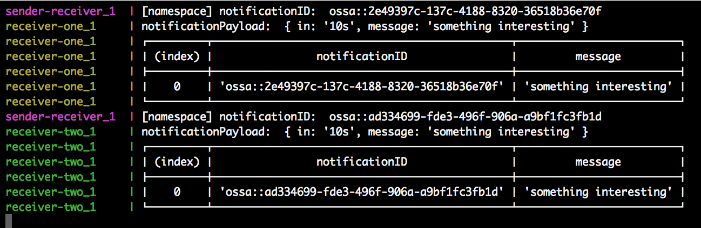

Make sure that you have `docker` installed and running.

To run the example:

```sh
$ cd examples/
$ make run
```

To create a notification, `curl` the `POST` endpoint `localhost:3000/send-notification`:

```sh
$ curl --location --request POST 'localhost:3000/send-notification' \
                        --header 'Content-Type: application/x-www-form-urlencoded' \
                --data-urlencode 'namespace=ossa' \
                --data-urlencode 'message=something interesting' \
                --data-urlencode 'in=10s'
```

You would get a response with the `notification_id`:

```json
{
    "namespace": "ossa",
    "message": "something interesting",
    "in": "10s",
    "notification_id": "ossa::ad334699-fde3-496f-906a-a9bf1fc3fb1d"
}
```

Go ahead and check the `docker logs`. You should see something like the following:



To clean up after running the application:

```sh
$ make clean
```